#Devices

This guide demonstrates how the simulated devices work in the IoT Suite remote monitoring solution.  You will learn how devices are configured and managed in the solution, and how telemetry and alarm history data from the devices are presented in the dashboard page of the web application. 

In this demonstration you will show how to

* observe telemetry and alarm history data from simulated devices,
* send commands to devices (cloud-to-device messaging),
* view device properties and command history stored in DocumentDB,
* configure device rules,
* add a new device to the solution

##Pre-requisites

This demonstration requires the following:

* Azure Subscription

##Setup

_Estimated Time: 10 minutes_

1. Open your browser to [https://azureiotsuite.com](https://azureiotsuite.com).

2. Authenticate to Azure IoT Suite using your Azure subscription credentials.

3. Click **Create a new solution**.

4. Click **Select** for the **Remote Monitoring solution**.

    a. Set the **Solution name** to _iotsuite-remote-mon_ .

    b. Select a **Region** close to you.

    c. Select your **Azure subscription** to deploy the solutoin into.

    d. Click **Create solution**.

    

##Demo Steps

_Estimated Time: 6 minutes_

1. Open your browser to [https://azureiotsuite.com](https://azureiotsuite.com).

2. Authenticate to Azure IoT Suite using your Azure subscription credentials.

3. Click **Launch** for the remote monitoring solution deployed in the Setup section.

4. Show the Telemetry History for the _SampleDevice001_x_ device.  This telemetry data is coming from a device simulator.  The device simulator is a WebJob (C#) that generates random temperature and humidity data that is then sent to IoT Hub every 5 seconds.  The occasional spike in the temperature data is intentional and was programmed into the device to show how rules are used to invoke alarms (ie: when temperature exceeds a certain threshold).

    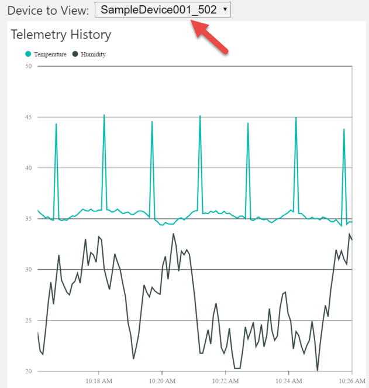

5.  Show the Alarm History for the _SampleDevice001_x_ device.  The Alarm History shown is a result of rules logic in the system.  When the temperature and humidity data for a device exceeds a specified threshold (the rule), an alarm is triggered.  

    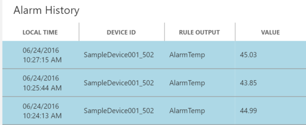

6. Click **RULES** on the left navigation and show the two default rules for the _SampleDevice001_x_ device.  These are created by default to bootstrap the system with logic to generate some Alarm History as shown previously on the DASHBOARD page.

    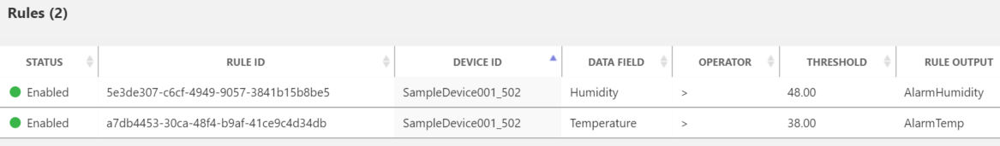

### Send Commands to a Device

1. Click **DEVICES** on the left navigation.  The solution creates these four simulated devices when it is first initialized.  We will see how to add new devices to the system later.

2. Click on _SampleDevice001_x_.

3. In the DEVICE DETAILS panel, click **Commands**.

    a. Set the command field to _StopTelemetry_.

    b. Click **Send Command**.

    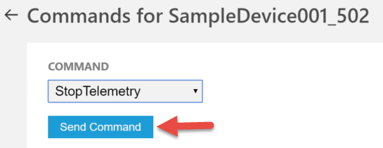

    If time permitting, go back to the DASHBOARD page to and show that telemetry data for the _SampleDevice001_x_ is not being updated.

    c. Set the command field to _ChangeDeviceState_.

    d. Set the device state field to _Paused for maintenance_.

    e. Click **Send Command**.

    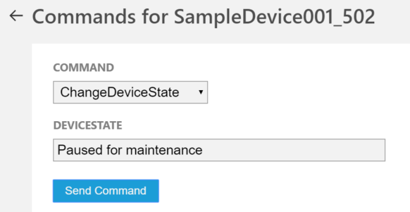

    f. Set the command field to _PingDevice_.

    g. Click **Send Command**.

    

    h. Set the command field to _StartTelemetry_.

    i. Click **Send Command**.

    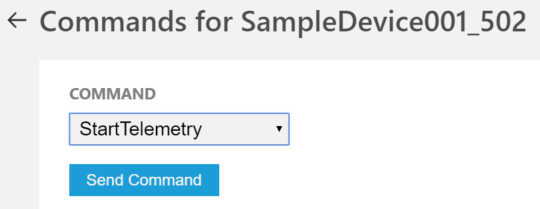

    j. Click **DASHBOARD** on the left navigation.

    k. Show the telemetry data for _SampleDevice001_x_ has resumed.

### View Device properties in DocumentDB

1. Open the Resource Group blade in the Azure portal for the remote monitoring solution.

2. Click on the **DocumentDB** resource to open the DocumentDB account blade.

3. Click **Document Explorer** in the toolbar.  

4. Click on the first document shown under the ID section. 

    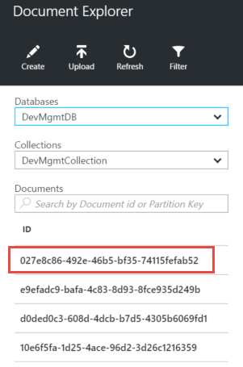

5. Show the updated DeviceState in the document as a result of the command issued previously.

    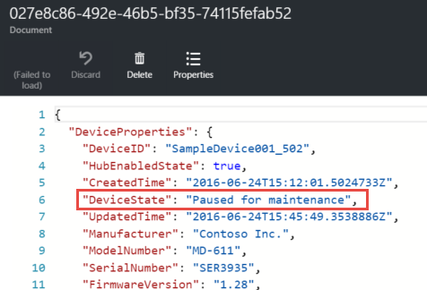

6. Scroll down the document to the CommandHistory array and who the commands issued to the device previously.

    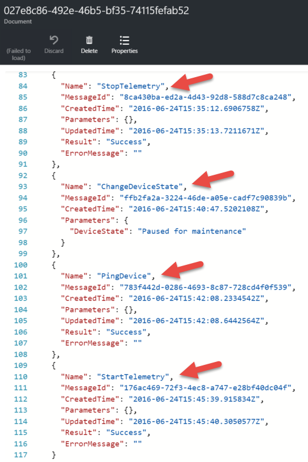

### Add a new rule

1. In the solution portal, click on **DEVICES** in the left navigation.

2. Click on _SampleDevice002_x_ in the device list.

3. In the DEVICE DETAILS panel click **Add Rule**.

    a. Set the DATA FIELD to _Humidity_.

    b. Set the THRESHOLD to _30_.

    c. Set the RULE OUTPUT to _AlarmHumidity_.
 
    d. Click **Save and View Rules**.

    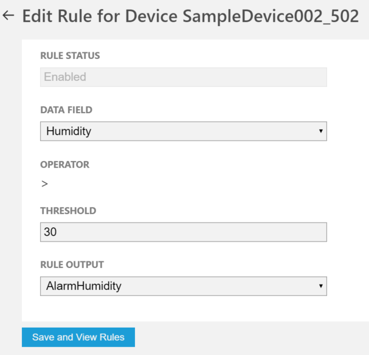

4. Click **DASHBOARD** in the left navigation.

5. Change the Device to View to _SampleDevice002_x_.

6. Show the Telemetry History for the device and if possible show where the humidity data has exceeded the threshold of 30.

    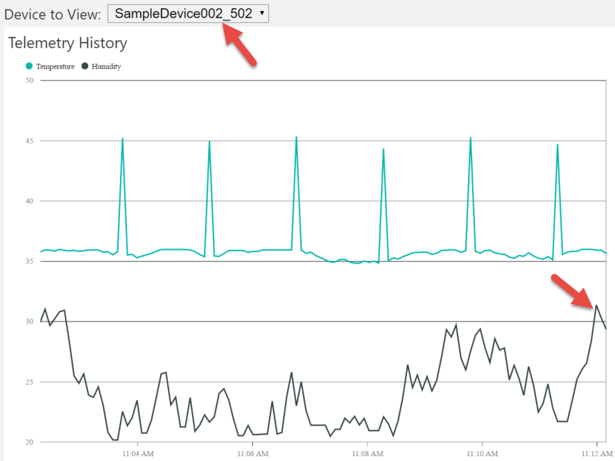

7. Show how the Alarm History is highlighting the alarms for _SampleDevice002_x_ as the humidity threshold was exceeded.

    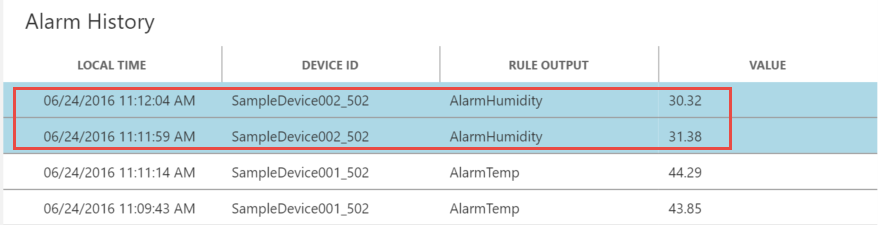

### Add a new Device

1. Click **ADD A DEVICE** in the left navigation.

2. In the Simulated Device panel, click **Add New**.

    a. Click the radio button to device your own Device ID.

    b. Set the Device ID to _demo-device-01_.

    c. Click **Check ID**.  Explain that this is checking for the availability of the device ID in IoT Hub's device registration database.

    d. Click **Create**.

    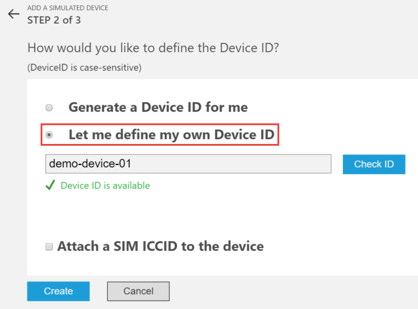

    e. Talk the audience through the _Device ID_, _IoT Hub Hostname_, and _Device Key_ that are shown.  Main point is that the Device ID and Device Key are what the device will use to authenticate to the IoT Hub instance.

    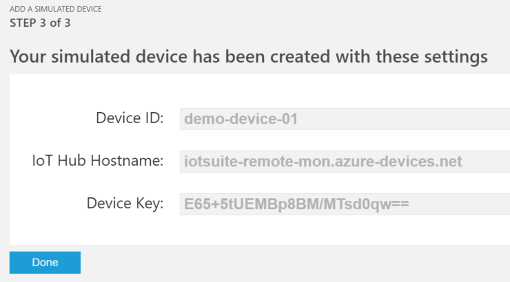

    f. Click **Done**.

3. Click **ADD A DEVICE** in the left navigation.

4. This time, in the Custom Device panel, click **Add New**.

    Point out that the properties and resulting Device ID and Device Key are the same as demonstrated for adding a new Simulated Device.  The main difference in this scenario is that you will have to upload code to the device to use the Device ID and Key to authenticate.  For an example of this process, see [http://bit.ly/28TdLve](http://bit.ly/28TdLve). 

5. Click **Cancel**.

##Cleanup

_Estimated Time: 5 minutes_

1. Open the Resource Group blade in the Azure portal for the remote monitoring solution.

2. Click **DELETE** in the toolbar.
 
